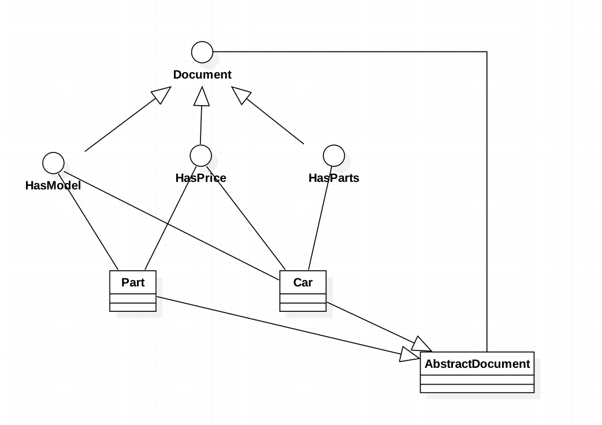

###定义:
Achieve flexibility of untyped languages and keep the type-safety

###使用场景:
* there is a need to add new properties on the fly

* you want a flexible way to organize domain in tree like structure

* you want more loosely coupled system

###真实例子