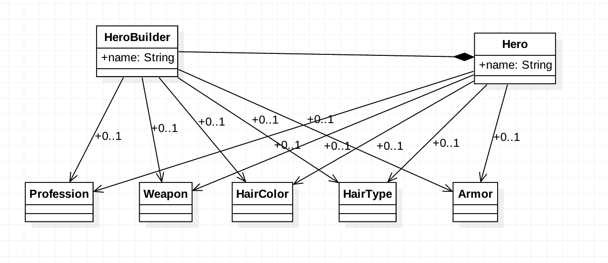

###定义：
Separate the construction of a complex object from its representation so that the same 
construction process can create different representations.
将复杂的对象构建与它的表示分离,以便同样的构建过程可以创建不同的表示

###应用场景：
* the algorithm for creating a complex object should be independent of the parts that make up 
  the object and how they're assembled
  
* the construction process must allow different representations for the object that's constructed

###真实案例:
####StringBuilder StringBuffer ByteBuffer Dialog