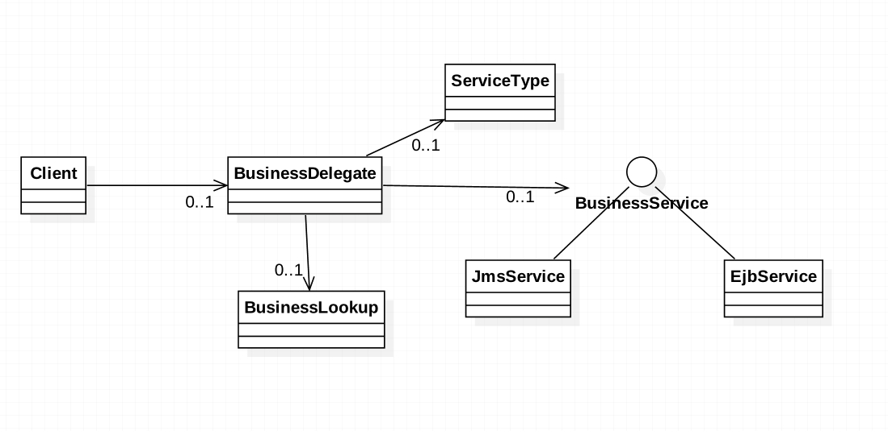

###定义：
The Business Delegate pattern adds an abstraction layer between presentation and business tiers. 
By using the pattern we gain loose coupling between the tiers and encapsulate knowledge about how to locate, connect to, 
and interact with the business objects that make up the application.
业务委托模式在表现层和业务层之间添加一个抽象层。这样能够松耦合层之间的关系,封装组成程序的业务对象之间的交互

###应用场景：
* you want loose coupling between presentation and business tiers

* you want to orchestrate calls to multiple business services

* you want to encapsulate service lookups and service calls

###真实案例: