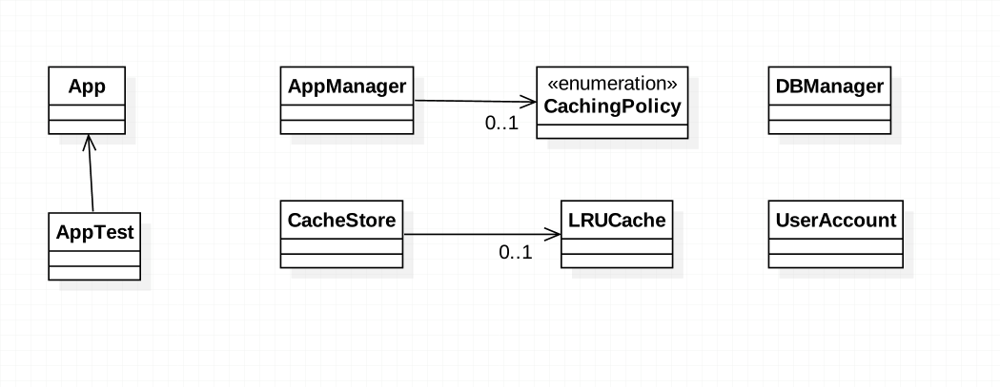

###定义：
To avoid expensive re-acquisition of resources by not releasing the resources immediately after their use. 
The resources retain their identity, are kept in some fast-access storage, and are re-used to avoid having to acquire them again.
使用完资源之后不立即释放以避免资源的重复请求

###应用场景：
* Repetitious acquisition, initialization, and release of the same resource causes unnecessary performance overhead.

###真实案例: