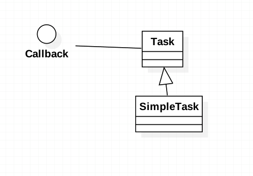

###定义：
Callback is a piece of executable code that is passed as an argument to other code, 
which is expected to call back (execute) the argument at some convenient time.
``Callback``是作为参数传递给其他代码的一段可执行代码

###应用场景：
* when some arbitrary synchronous or asynchronous action must be performed after execution of some defined activity.

###真实案例:

CyclicBarrier