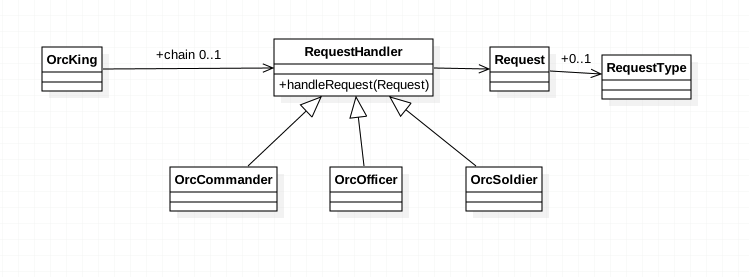

###定义：
Avoid coupling the sender of a request to its receiver by giving more than one object a chance to handle the request. 
Chain the receiving objects and pass the request along the chain until an object handles it.
很多对象由每一个对象对其下家的引用而连接起来形成一条链。请求在这个链上传递，直到链上的某一个对象决定处理此请求

###应用场景：
* more than one object may handle a request, and the handler isn't known a priori. The handler should be ascertained automatically
  
* you want to issue a request to one of several objects without specifying the receiver explicitly

* the set of objects that can handle a request should be specified dynamically

###真实案例:
####Android TouchEvent