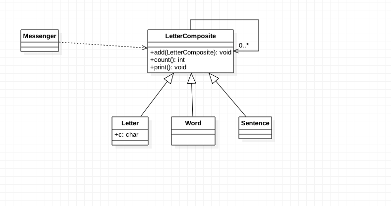

###定义：
允许你将对象组合成树形结构来表现"整体/部分"层次结构。组合能让客户以一致的方式处理对象以及对象组合

###应用场景：
* you want to represent part-whole hierarchies of objects
* you want clients to be able to ignore the difference between compositions of objects and individual objects. 
  Clients will treat all objects in the composite structure uniformly

###真实案例:
####ViewGroup awt.Component