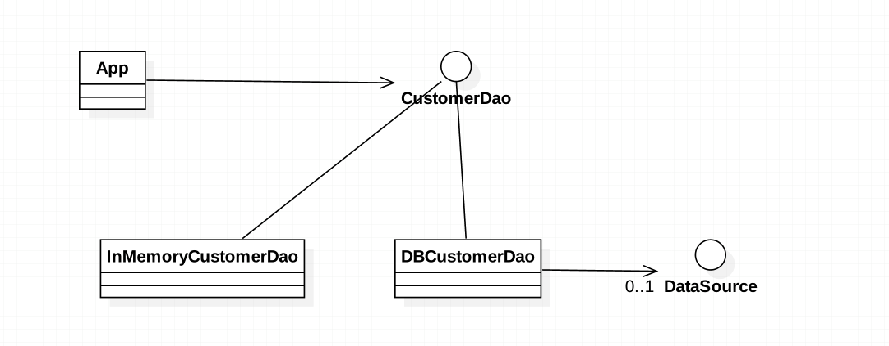

###定义：
Object provides an abstract interface to some type of database or other persistence mechanism.
为数据库或其他持久化机制提供一个抽象接口

###应用场景：
* when you want to consolidate how the data layer is accessed
* when you want to avoid writing multiple data retrieval/persistence layers

###真实案例: