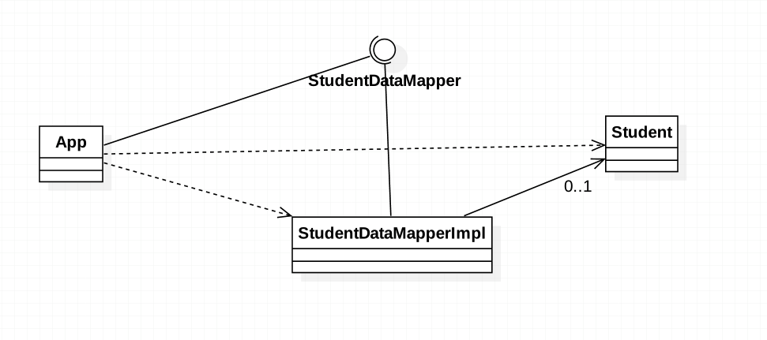

###定义：
A layer of mappers that moves data between objects and a database while keeping them independent of each other and the mapper itself
在对象与数据库之间传递数据的同时并保持各自的独立的映射层

###应用场景：
* when you want to decouple data objects from DB access layer

* when you want to write multiple data retrieval/persistence implementations

###真实案例: