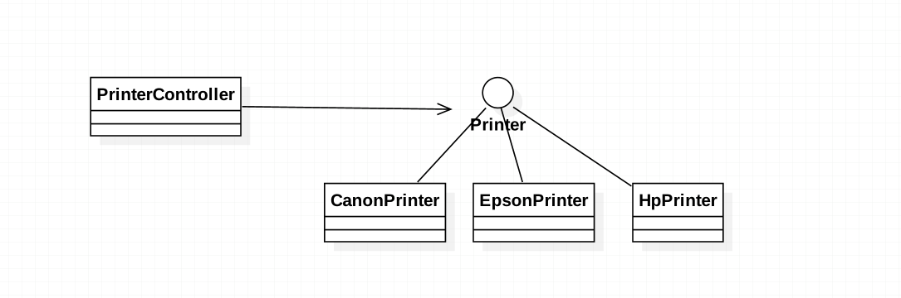

###定义：
It is a technique where an object expresses certain behavior to the outside but in reality delegates responsibility 
for implementing that behaviour to an associated object.

###应用场景：
* Reduce the coupling of methods to their class

* Components that behave identically, but realize that this situation can change in the future.

###真实案例: