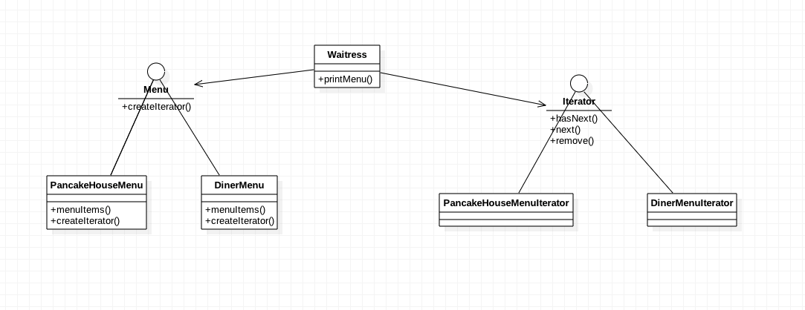

###定义：
提供一种方法顺序访问一个聚合对象中的各个元素，而又不暴露其内部的表示

###应用场景：
* to access an aggregate object's contents without exposing its internal representation
* to support multiple traversals of aggregate objects
* to provide a uniform interface for traversing different aggregate structures

###真实案例:
#### Iterator Enumeration Collections