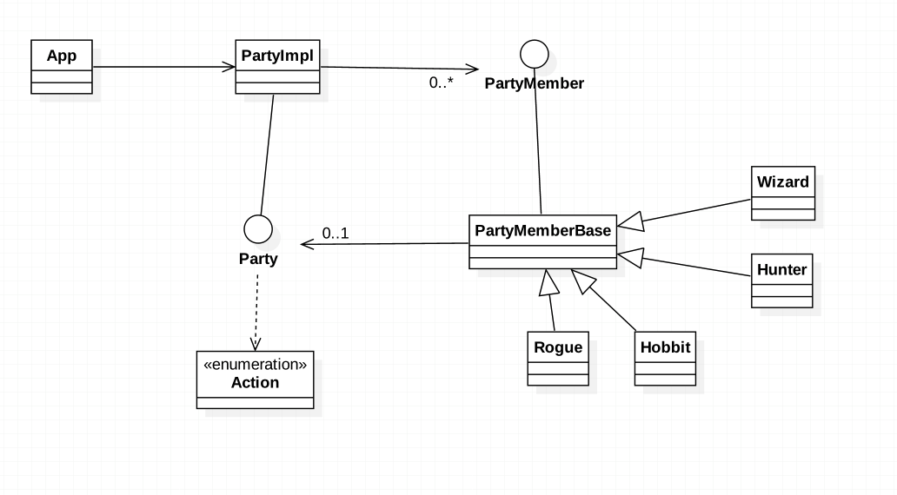

###定义：
定义一个中介对象来封装系列对象之间的交互。中介者使各个对象不需要显示地相互引用，从而使其耦合性松散，而且可以独立地改变他们之间的交互。

###应用场景：
* a set of objects communicate in well-defined but complex ways. 
  The resulting interdependencies are unstructured and difficult to understand
  
* reusing an object is difficult because it refers to and communicates with many other objects

* a behavior that's distributed between several classes should be customizable without a lot of subclassing

###真实案例:
#### Timer scheduleXXX() ExecutorService