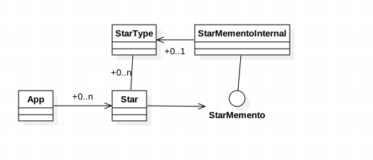

###定义：
Without violating encapsulation, capture and externalize an object's internal state so that the object can be restored to this state later.
在不破坏封闭的前提下，捕获一个对象的内部状态，并在该对象之外保存这个状态。这样以后就可将该对象恢复到原先保存的状态。

###应用场景：
* a snapshot of an object's state must be saved so that it can be restored to that state later, and
* a direct interface to obtaining the state would expose implementation details and break the object's encapsulation

###真实案例:
#### Date Activity onRestoreInstanceState Canvas