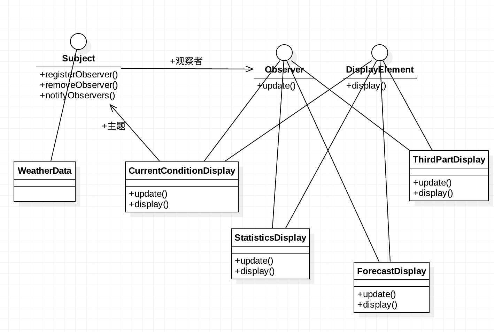

###定义：
定义了对象之间的一对多依赖，这样一来，当一个对象改变状态时，它的所有依赖者都会收到通知并自动更新

###应用场景：
* 当抽象有个变化,一个依赖于另一个。在各自的对象中封装这些变化能够单独的复用
* 一个对象的改变会改变其他对象，但你并不需要知道有多少对象需要改变
* 不想要独享紧密耦合

###真实案例:
####[Observer](http://docs.oracle.com/javase/8/docs/api/java/util/Observer.html)
####Android View事件