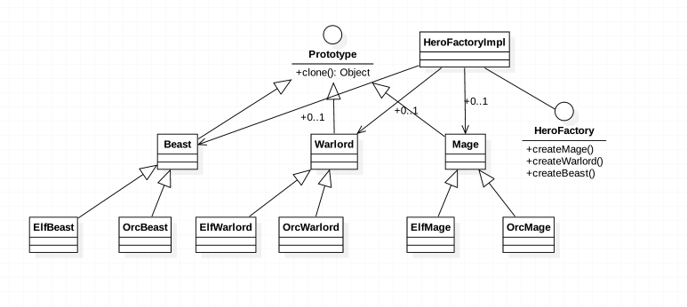

###定义:
用原型实例指定创建对象的种类，并通过拷贝这些原型创建新的对象

###使用场景:
* when the classes to instantiate are specified at run-time, for example, by dynamic loading

* to avoid building a class hierarchy of factories that parallels the class hierarchy of products

* when instances of a class can have one of only a few different combinations of state. It may be more convenient to 
  install a corresponding number of prototypes and clone them rather than instantiating the class manually, each time 
  with the appropriate state

###真实例子
* Object.clone