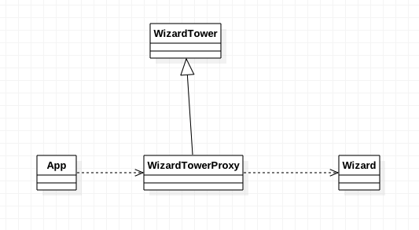

###定义：
为另一个对象提供一个替身或占位符以控制对这个对象的访问，远程代理，虚拟代理,动态代理 

###应用场景：
* a remote proxy provides a local representative for an object in a different address space.(远程代理)
* a virtual proxy creates expensive objects on demand.(虚拟代理)
* a protection proxy controls access to the original object. Protection proxies are useful when objects 
  should have different access rights.
  
###真实案例:
* Proxy AIDL Binder