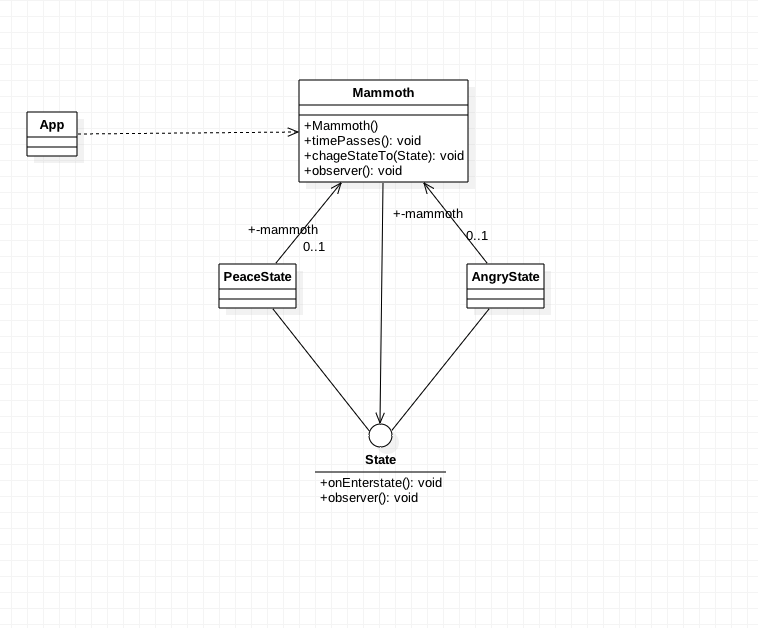

###定义：
允许对象在内部状态改变时改变它的行为，对象看起来好像修改了类。策略模式和状态模式是双胞胎，在出生时才分开

###应用场景：
* 对象的行为依赖它的状态，并且会根据状态来改变行为
* operations have large, multipart conditional statements that depend on the object's state. 
  This state is usually represented by one or more enumerated constants. Often, several operations 
  will contain this same conditional structure. The State pattern puts each branch of the conditional 
  in a separate class. This lets you treat the object's state as an object in its own right that can 
  vary independently from other objects.

###真实案例:
* [JDiameter - Diameter State Machine](https://github.com/npathai/jdiameter/blob/master/core/jdiameter/api/src/main/java/org/jdiameter/api/app/State.java)
* Future