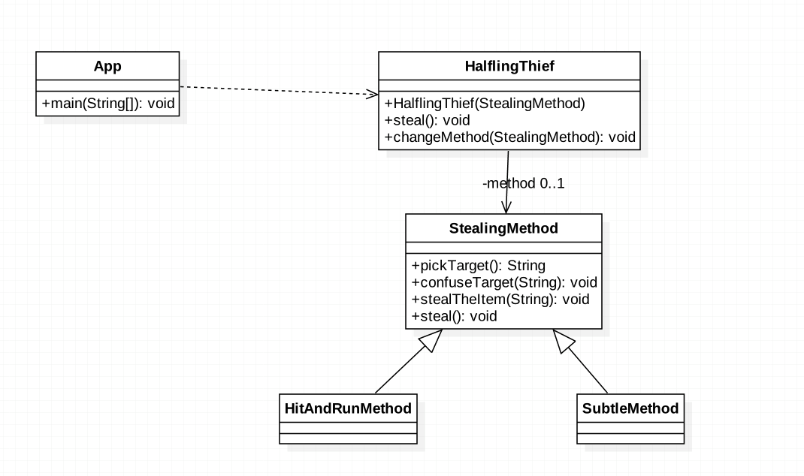

###定义:
在一个方法中定义一个算法的骨架，而将一些步骤延迟到子类中。模板方法使得子类可以在不改变算法结构的情况下，重新定义算法的某些步骤

###使用场景:
* to implement the invariant parts of an algorithm once and leave it up to subclasses to implement the behavior that can vary

* when common behavior among subclasses should be factored and localized in a common class to avoid code duplication.
  This is good example of "refactoring to generalize" as described by Opdyke and Johnson.
  You first identify the differences in the existing code and then separate the differences into new operations.
  Finally, you replace the differing code with a template method that calls one of these new operations

* to control subclasses extensions. You can define a template method that calls "hook" operations at specific points,
  thereby permitting extensions only at those points
###真实例子
####Arrays, InputStream等