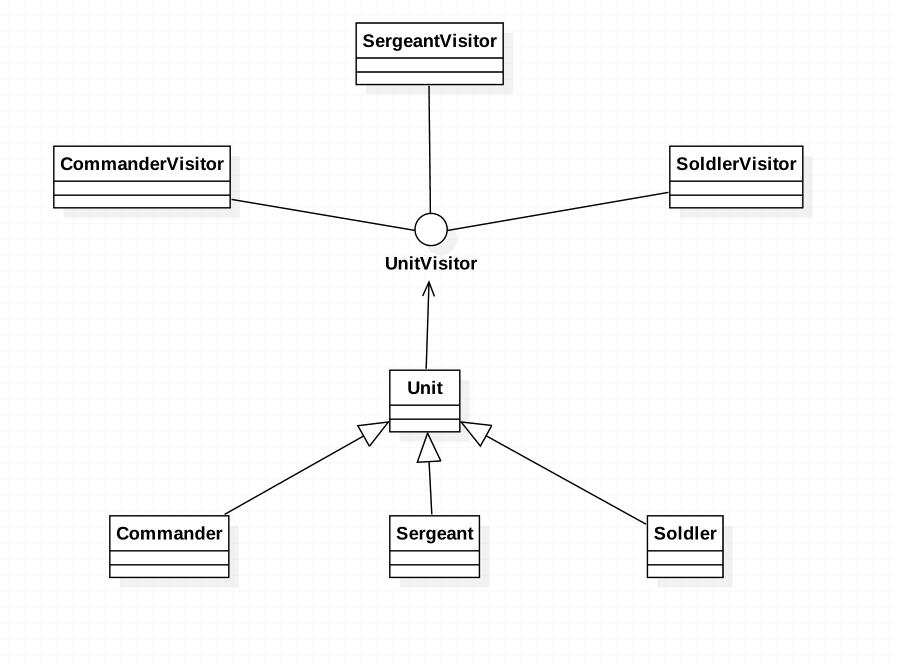

###定义:
表示一个作用于某对象结构中的各元素的操作。它使你可以在不改变各元素类的前提下定义作用于这些元素的新操作。

###使用场景:
* an object structure contains many classes of objects with differing interfaces, 
  and you want to perform operations on these objects that depend on their concrete classes

* many distinct and unrelated operations need to be performed on objects in an object structure, 
  and you want to avoid "polluting" their classes with these operations. 
  Visitor lets you keep related operations together by defining them in one class. 
  When the object structure is shared by many applications, use Visitor to put operations in just those applications that need them

* the classes defining the object structure rarely change, but you often want to define new operations over the structure. 
  Changing the object structure classes requires redefining the interface to all visitors, which is potentially costly. 
  If the object structure classes change often, then it's probably better to define the operations in those classes
  
###真实例子
####APT(Annotation Process Tool)